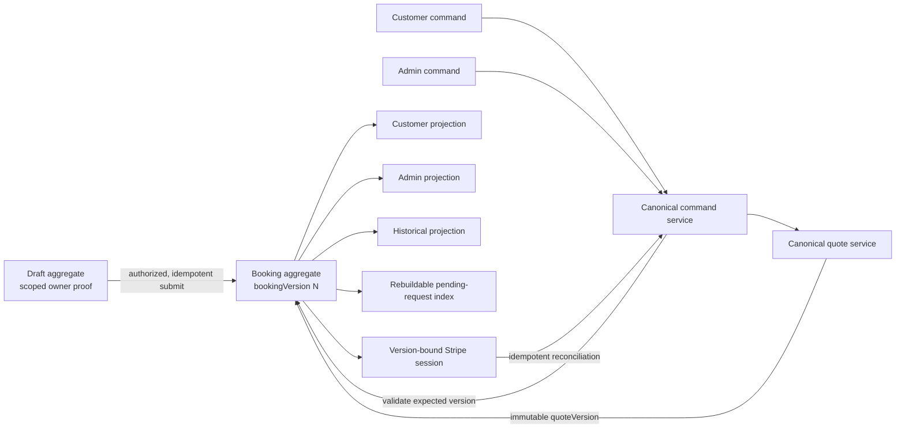
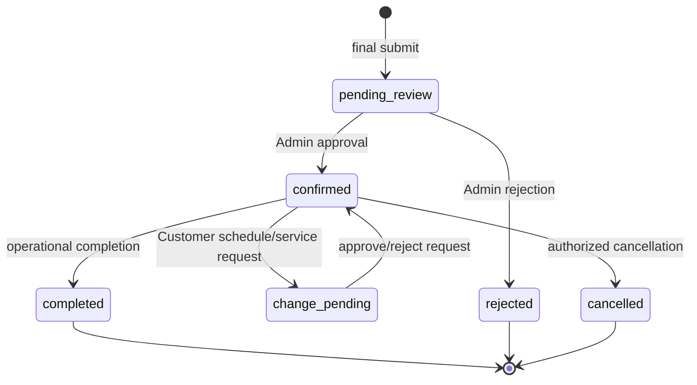

# Authoritative State Model — Release A

**Purpose:** define the minimum canonical state and invariants needed for draft/request/appointment separation, Customer/Admin synchronization, versioning, authoritative totals, refresh consistency, and historical reads.

This document is a target model, not a claim that the current branch implements it.

## One authority, multiple projections

The submitted booking aggregate in `cd1-bookings` must be the only write authority after final submission. Customer, Admin, and payment views are projections of the same aggregate revision. A secondary request queue may exist for indexing, but it is rebuildable and must never be the authority for request status or applied money.



## Entity separation

### 1. Draft

A draft is not a request, booking, appointment, job, invoice, or Customer Garage record.

Required fields:

```text
draftId
kind = "draft"
draftVersion
schemaVersion
ownerProofHash
content
createdAt / updatedAt / expiresAt
submittedBookingId? / submittedAt?
```

Rules:

- Draft read/write/finalize requires its scoped owner proof; draft ID alone is never authority.
- Draft endpoints are the only endpoints allowed to return `kind=draft`.
- Finalization is idempotent: the same valid submission key returns the same booking ID/version.
- Finalization creates one submitted aggregate and permanently closes/links the draft.
- Customer/Admin/Technician booking feeds centrally reject drafts.

### 2. Submitted request / booking

The initial public submission creates a submitted booking in `pending_review`. It is no longer a draft, but it is not yet a confirmed appointment.

Required top-level fields:

```text
schemaVersion
bookingId
bookingVersion
kind = "booking"
customerRef
lifecycle
service
quote
ledger
changeRequests[]
paymentAttempts[]
events[]
createdAt / updatedAt
```

### 3. Appointment

An appointment is an approved scheduling state inside the submitted booking aggregate, not an alias for the booking request.



Technician execution states remain a distinct lifecycle dimension. Release A must preserve them when writing/reading the aggregate, but changing Technician eligibility or transition UX is outside this release.

## Canonical structured service

`service.vehicles[]` is the canonical service selection. Top-level `package`, `addons`, labels, and counts are compatibility projections only and cannot be accepted as independent write authorities.

```text
service = {
  serviceAddress,
  zip,
  vehicles: [{
    vehicleId,            // stable, never array position as identity
    category,
    tier,
    make,
    model,
    year,
    packageId,
    addOnIds[]
  }]
}
```

Every Customer change carries a structured target and delta:

```text
target = { vehicleId? }
delta = {
  packageId?,
  addOnIdsToAdd[]?,
  addOnIdsToRemove[]?,
  requestedDate?,
  requestedTime?,
  serviceAddress?
}
```

Free-text labels may accompany the projection but never choose price or mutation targets.

## Request and quote versioning

Each change request is immutable except for its decision/application envelope:

```text
changeRequest = {
  requestId,
  requestVersion,
  baseBookingVersion,
  quoteVersion,
  type,
  target,
  delta,
  status,               // pending | rejected | apply_failed | applied | superseded
  submittedBy,
  submittedAt,
  decision?,
  appliedBookingVersion?
}
```

Each quote is an immutable server result:

```text
quote = {
  quoteVersion,
  basedOnBookingVersion,
  catalogVersion,
  currency = "usd",
  inputsHash,
  lineItems[],
  serviceSubtotalCents,
  travelCents,
  adjustmentCents,
  offerCents,
  approvedCents,
  createdAt
}
```

Rules:

- Client-provided totals are ignored/rejected.
- `quoteVersion` is generated only after canonical structured validation and pricing.
- Admin cannot apply a request when `baseBookingVersion` or `quoteVersion` is stale; it must rebase/requote and obtain an explicit decision on the new amount.
- A request becomes `applied` only in the same authoritative commit that creates `appliedBookingVersion`.
- Replaying a decision is idempotent and cannot create a second booking revision.

## Monetary ledger

Only ledger inputs are persisted as authority. Remaining due is derived.

```text
ledger = {
  currency = "usd",
  approvedCents,
  settledCents,
  creditedCents,
  pendingCents,
  lastReconciledAt,
  entries[]
}

remainingCents = max(approvedCents - settledCents - creditedCents, 0)
```

`amountDueApproved`, `balanceDue`, `totalPrice`, and display-dollar fields may be emitted as compatibility projections, but no write path may trust them ahead of the ledger. A compatibility write must translate to a typed ledger/quote command or be rejected.

Core invariants:

1. `remainingCents` is derived, never an independently editable source.
2. `approvedCents` comes from the current canonical quote plus explicit versioned adjustments/offers.
3. A payment attempt records `bookingVersion`, `quoteVersion`, currency, and exact amount.
4. A quote change supersedes and expires every open session for the older version.
5. Reconciliation is idempotent by Stripe object/event identity and cannot credit more than the verified amount.
6. Paid/closed historical state fails payment closed even when legacy money fields are incomplete.

## Conditional command contract

Every Release A mutation follows one command boundary:

1. Authenticate/authorize the normal workflow credential.
2. Read the aggregate and its storage revision.
3. Verify `expectedBookingVersion` and request/quote versions.
4. Validate lifecycle and structured input.
5. Reprice through the single canonical quote service when service/money changes.
6. Build the next aggregate without mutating the old object.
7. Conditionally persist version N+1.
8. Return the complete projection and its version.
9. Rebuild/update non-authoritative indexes after the authoritative commit; index failure is recoverable and visible, not a partial business decision.

If the repository's Blob adapter cannot provide a true conditional write, Release A must introduce an equivalent serialized/idempotent command mechanism before claiming conflict safety. A read-then-unconditional-set is not sufficient.

## Projection contract

Customer and Admin responses for the same booking must include:

```text
bookingId
bookingVersion
schemaVersion
effectiveLifecycle
service projection
current quoteVersion
approvedCents
settledCents
remainingCents
request summaries with requestVersion/status/appliedBookingVersion
updatedAt
```

Refresh requirements:

- Responses are `no-store` where appropriate and ordered deterministically.
- Account lists iterate all storage pages and expose a cursor when response pagination is intentional.
- The selected “upcoming” item is chosen by a documented stable sort, not Blob list order.
- An action link exchanges its raw token for a short-lived scoped session or retains it only in memory; refresh does not fall back silently to stale state.
- A client holding version N can tell when it receives N+1 and never merges two revisions locally.

## Historical-read compatibility

Release A must use non-destructive read adapters:

1. Detect `schemaVersion`; treat absent version as legacy version 0.
2. Normalize aliases (`id`/`bookingId`, phone fields, lifecycle fields) through one shared adapter.
3. Validate arrays with `Array.isArray`; default optional invalid containers safely and quarantine materially invalid records per item.
4. Map legacy `Paid` and `Closed` to completed historical state and payment-locked ledger semantics.
5. Never let one malformed historical record fail the complete account/Admin response.
6. Preserve the original Blob; emit telemetry/audit data for records needing migration.
7. Iterate all Blob cursor pages and sort projections deterministically.

## Compatibility and rollback

Release A must be forward-write/backward-read:

- New writes use the new schema/version contract.
- Reads continue to project current and historical records.
- Compatibility fields are derived for old UI consumers during rollout.
- Feature flags may switch new command paths off, but must not revert records to an older schema or re-enable unversioned money writes.
- Roll back the deployment if version conflicts are bypassed, canonical repricing changes an already approved revision, a secondary index becomes authoritative, or any paid/historical fixture becomes payable.
