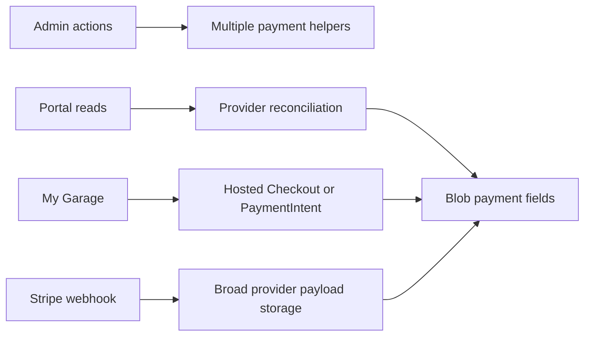
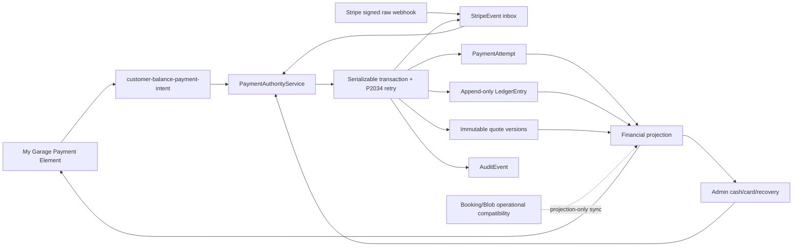

# PR1 — Financial invariants and Stripe authority

Status: **READY FOR OWNER REVIEW**

Audit date: **2026-08-05 (America/New_York)**

Branch: `fix/financial-invariants-pr1`

Stacked base: PR #157, branch `claude/admin-payment-operations-g11gru`, commit `0c6ae0ac1393da37e71bb08d83c9ead51f1237cc`

Production deploy/merge/migration: **not performed**

## Executive decision

PR1 makes PostgreSQL the fail-closed money authority for customer balance payments, on-site cash/card settlements, and Stripe webhook reconciliation. It removes competing browser payment paths, stops read requests from mutating payment state, separates payment completion from service completion, minimizes provider event data, and adds optimistic-concurrency requirements to customer/admin mutations.

The branch passed the complete repository suite, a real PostgreSQL 16 migration rehearsal, Prisma history/schema parity, the deterministic pre-deploy audit, a Netlify deploy-preview build, and desktop/mobile browser inspection. Refund execution remains intentionally disabled until PR2 supplies a signed-webhook-authoritative refund state machine.

## Scope and isolation

- No Owner Studio source file changed.
- No commit was added to PR #157; this branch starts at its exact head SHA.
- No production database, Stripe account, SMS destination, Netlify deploy, merge, or live secret was used.
- Hosted Checkout and legacy capture/payment endpoints return fail-closed tombstones. Customer balance payment uses the embedded Stripe Payment Element path only.
- Existing Booking/Blob operational fields remain compatibility data. They are not a second ledger.

## Architecture

### Before PR1



The defects were not cosmetic: a read could reconcile money, multiple endpoints could create competing payable objects, webhook ordering was not a durable invariant, raw provider structures could be retained, and payment actions could implicitly close service work.

### After PR1



## Authoritative invariants

1. One active payable obligation exists for a booking/quote/purpose. PaymentIntent creation uses a deterministic idempotency key and validates provider ID, customer, currency, amount, purpose, booking, and quote version before returning a client secret.
2. Browser responses contain only the secrets/values needed by Stripe.js; no raw card data is accepted or persisted by Cardetail1.
3. A signed Stripe webhook is authoritative for customer-balance provider state. Duplicate deliveries are idempotent and failed inbox rows are reprocessable.
4. A settlement ledger credit is unique (`settlement_<payment_intent_id>`). Attempt state, ledger entry, quote state, and inbox status change in one serializable transaction.
5. Out-of-order nonterminal provider events cannot regress newer or terminal state. A valid `payment_intent.succeeded` can still settle if delivered late.
6. Normal Admin/My Garage reads do not call Stripe and do not mutate financial state. Admin reconciliation is an explicit delayed recovery action for an unresolved attempt with a provider reference.
7. Cash and card-on-site settlements require Postgres, the expected booking version, the current authoritative quote projection, amount, reason, and a safe reference. They create ledger/audit entries without closing the service/job.
8. Service completion is a separate versioned customer/admin action.
9. Refund execution is fail-closed (`501 refund_execution_pending_pr2`) until PR2. No local “refunded” truth can be written before provider confirmation.
10. PostgreSQL absence fails financial writes closed; legacy compatibility remains read-only/projection-only.

## Endpoint and surface inventory

| Surface | PR1 behavior |
|---|---|
| `customer-balance-payment-intent` | Authenticated, rate-limited, Postgres-required, versioned, server-priced PaymentIntent/CustomerSession preparation |
| `stripe-webhook` | Raw-body signature verification; transactional balance reconciliation; SetupIntent binding/CAS; non-balance compatibility isolated |
| `create-setup-intent` | Draft token before version disclosure; consent and expected version required; deterministic customer/SetupIntent reuse |
| `admin-ops-jobs` | Explicit recovery reconcile; versioned/reasoned on-site settlements; hosted/refund policy operations isolated |
| `customer-portal-action` | Versioned completion approval independent of payment status |
| `customer-portal-data` | Projection read only; no provider mutation |
| `customer-portal-pay` | `410 legacy_checkout_disabled` |
| `create-payment-intent` | `410 legacy_payment_intent_disabled` |
| `capture-payment` | `410 legacy_manual_capture_disabled` |
| Admin UI | Hosted payment controls removed; cash/card require amount, reason, reference, and expected version; reconcile is gated |
| My Garage UI | Embedded Payment Element only; hosted Checkout fallback removed; expected versions sent |
| 13 booking pages | Draft booking version carried through card-save CAS |

## Data model and migration

Migration: `prisma/migrations/20260805090000_financial_invariants_pr1/migration.sql`

- `PaymentAttempt`: purpose, provider customer, last provider event ID/time; positive-amount check.
- `StripeEvent`: attempt/error/provider timestamps, processing status index, minimized JSON object check.
- Historical `StripeEvent.payload`: rewritten to a strict reconciliation summary; `client_secret`, billing/payment-method/card/charge/error/raw fields are discarded.
- Existing `LedgerEntry`: non-adjustment amount must be positive. Ledger rows are not rewritten.
- Checks are introduced `NOT VALID`: they protect new rows immediately while allowing an owner-controlled preflight and later validation on production data.

### Real PostgreSQL 16 evidence

Isolated local cluster: PostgreSQL **16.14**, port 55432, trust limited to the disposable local test cluster.

Fresh database `cardetail1_pr1_empty_b`:

```text
5 migrations found
Database schema is up to date!
No difference detected.
```

Representative four-migration upgrade copy `cardetail1_pr1_upgrade_a`:

```text
16.14|1|1|t|MIG-REP-1|3
LedgerEntry_financial_amount_nonzero=true
PaymentAttempt_amount_positive=true
StripeEvent_payload_is_object=true
attempt_issues=0
ledger_issues=0
payload_issues=0
```

The representative row retained its booking/provider binding and lost the seeded secret/billing/card material. All three constraints were then validated successfully in the rehearsal copy.

### Owner production preflight (do not skip)

Run against a recent production backup/clone first:

```sql
SELECT count(*) AS invalid_attempts
FROM "PaymentAttempt" WHERE "amountCents" <= 0;

SELECT count(*) AS invalid_ledger_rows
FROM "LedgerEntry"
WHERE "kind" <> 'adjustment' AND "amountCents" <= 0;

SELECT count(*) AS invalid_event_payloads
FROM "StripeEvent" WHERE jsonb_typeof("payload") <> 'object';

SELECT count(*) AS sensitive_event_payloads
FROM "StripeEvent"
WHERE "payload"::text ~* 'client_secret|billing_details|payment_method_details|card|charges|raw';
```

Expected result: zero in every query. Review any nonzero result manually; do not “fix” ledger history in place.

After owner approval, backup, and successful preflight:

```bash
npx prisma migrate deploy
npx prisma migrate status
```

Then, in a controlled follow-up migration/window after production verification:

```sql
ALTER TABLE "PaymentAttempt" VALIDATE CONSTRAINT "PaymentAttempt_amount_positive";
ALTER TABLE "LedgerEntry" VALIDATE CONSTRAINT "LedgerEntry_financial_amount_nonzero";
ALTER TABLE "StripeEvent" VALIDATE CONSTRAINT "StripeEvent_payload_is_object";
```

## Verification evidence

| Gate | Result |
|---|---|
| Prisma client generation | pass, Prisma 7.8.0 |
| Full test suite | **2,156 passed; 0 failed; 0 skipped; 133 suites; 54.338 s** |
| Fresh migration history | pass, 5/5 migrations |
| Migration/schema diff | pass, `No difference detected` |
| Representative upgrade | pass, zero invariant violations, sensitive event fields removed |
| Deterministic pre-deploy audit | pass, syntax and targeted release checks green |
| Netlify build | pass, `deploy-preview`, offline, @netlify/build 36.3.0, 2m26.6s |
| Stripe calls in tests | fake/injected only; no live Stripe call |
| SMS/Twilio | no message sent |
| Owner Studio | no changed file |

High-value regression coverage includes duplicate/signed/out-of-order webhooks; repeated replay; timeout recovery; provider binding mismatch; exact amount/currency; secret minimization; concurrent/idempotent settlement; on-site cash/card replay; no service auto-close; SetupIntent consent/version/CAS; legacy endpoint tombstones; and Admin/My Garage projection parity.

## Browser evidence

Local static preview was exercised through the real UI. ZIP `07650` changed to the New Jersey route, package selection opened Step 03, and all four vehicle types were available. The flow then reached Step 05 without submitting a booking or touching Stripe.

- [ZIP → vehicle, desktop](evidence/pr1-zip-vehicle-desktop.png)
- [ZIP → vehicle, mobile](evidence/pr1-zip-vehicle-mobile.png)
- [Card-save notice, desktop](evidence/pr1-card-notice-desktop.png)
- [Card-save notice, mobile](evidence/pr1-card-notice-mobile.png)

Measured notice style in the browser: `opacity: 1`, background `rgb(248, 250, 252)`, text `rgb(30, 41, 59)`, blue left border, and no horizontal overflow. The notice is readable without selecting/highlighting its text.

Authenticated Admin/My Garage data states are covered by deterministic integration tests in PR1. No fabricated production login or customer/payment data was used for screenshots.

## Primary-source decisions (researched 2026-08-05)

- [Stripe Payment Intents](https://docs.stripe.com/payments/payment-intents) and [lifecycle](https://docs.stripe.com/payments/paymentintents/lifecycle): one intent per payment purpose/order; reuse and reconcile its lifecycle rather than minting competing obligations.
- [Stripe Elements](https://docs.stripe.com/payments/elements), [save during payment](https://docs.stripe.com/payments/save-during-payment?payment-ui=elements), and [save customer methods](https://docs.stripe.com/payments/save-customer-payment-methods?locale=en-GB): Stripe.js tokenizes payment details; future-use consent is explicit; Cardetail1 does not store raw card data.
- [Stripe webhooks](https://docs.stripe.com/webhooks?lang=node): verify the raw signed body; expect duplicate delivery and no guaranteed ordering; return non-2xx for retryable processing failure.
- [Stripe idempotent requests](https://docs.stripe.com/api/idempotent_requests?lang=curl): deterministic keys protect retried provider writes.
- [Stripe Checkout](https://docs.stripe.com/payments/checkout): retained as a documented Stripe product, but intentionally not a second Cardetail1 balance-payment path in PR1.
- [Prisma transactions](https://www.prisma.io/docs/orm/prisma-client/queries/transactions): serializable transactions plus retry on write conflict/deadlock (`P2034`).
- [Prisma production migrations](https://docs.prisma.io/docs/orm/v6/prisma-migrate/workflows/development-and-production), [migration histories](https://www.prisma.io/docs/orm/prisma-migrate/understanding-prisma-migrate/migration-histories), and [shadow database](https://docs.prisma.io/docs/orm/prisma-migrate/understanding-prisma-migrate/shadow-database): immutable reviewed history, `migrate deploy` in production, and explicit shadow URL for diff verification.
- [PostgreSQL 16 constraints](https://www.postgresql.org/docs/16/ddl-constraints.html) and [`INSERT ... ON CONFLICT`](https://www.postgresql.org/docs/current/sql-insert.html): database uniqueness/checks and conflict-safe insert behavior back application idempotency.
- [Netlify Functions overview](https://docs.netlify.com/build/functions/overview/) and [configuration](https://docs.netlify.com/build/functions/configuration/?fn-language=js): functions are stateless execution units, so webhook/retry truth belongs in durable PostgreSQL, not process memory.

## Rollback and incident handling

1. Roll back the application bundle/commit first. The migration is additive to the operational schema and old application code can ignore the added columns.
2. Do **not** delete or reverse ledger entries to roll back an application release. Correct financial history only with explicit compensating entries after owner/provider verification.
3. Do **not** run an automatic down migration in production. Retain the added columns, inbox metadata, indexes, and constraints while the application is rolled back.
4. Historical Stripe event minimization is intentionally irreversible from the live database. Restore the pre-migration backup to an isolated forensic database only if the removed provider payload is legally/operationally required.
5. If webhook processing fails, preserve the `StripeEvent` row and return non-2xx so Stripe retries. Investigate the sanitized `errorCode`; do not copy raw events or secrets into logs/tickets.

## Canary/smoke checklist for the owner

- Confirm required Postgres and Stripe environment variables in the approved deploy context; never paste values into the PR.
- Apply migration only after backup and zero-result preflight.
- Verify Stripe webhook endpoint/signing secret and send Stripe test-mode events only.
- Open My Garage with a designated test booking; verify the Payment Element, expected amount, and no hosted redirect.
- Replay the same signed test event; confirm one settlement entry and a processed/idempotent inbox result.
- Attempt stale Admin/My Garage mutations; confirm `409`/reload behavior.
- Record one test cash and one safe card-on-site reference; confirm payment becomes paid while service remains open.
- Verify Admin and My Garage display the same approved/settled/refunded/remaining values.
- Watch function error rate, webhook retry age, inbox `failed/processing` rows, and Postgres transaction conflicts before increasing traffic.

No remote p50/p95 latency is claimed in PR1 because this task explicitly forbids a deployment. End-to-end sync/latency metrics belong to the controlled deploy-preview/canary work in PR3.

## Deferred, explicit boundaries

- **PR2:** refund/adjustment/receipt lifecycle with signed provider confirmation.
- **PR3:** sync convergence, retry/backoff, polling/stale UX, p50/p95 and conflict metrics.
- **PR4:** operational/customer workflow completion, reschedule/cancel/photo/service-state QA.
- **PR5:** Twilio Messaging Service, consent, STOP/HELP, status callback validation, quiet-hour policy, and failure/retry UI.
- Existing `Cardetail1` / `Detailing Zone LLC` dual-brand copy is visible in policy text. Consolidation is a commercial/legal owner decision, not silently changed in PR1.

## Owner review checklist

- [ ] Confirm PR #157 remains the intended stacked base.
- [ ] Review financial invariant and webhook state-machine tests.
- [ ] Approve historical StripeEvent payload minimization.
- [ ] Run backup/clone preflight and review any nonzero row personally.
- [ ] Confirm PR2 owns refund execution before enabling any refund control.
- [ ] Approve deploy-preview/canary plan; do not merge or deploy directly from this audit.
