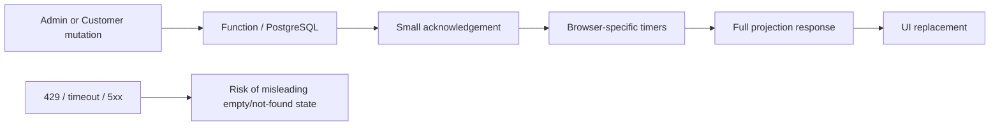
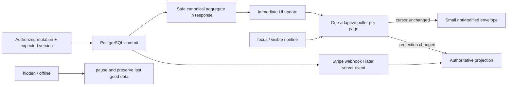

# PR3 — Portal synchronization

Date: 2026-08-05  
Branch: `fix/portal-sync-pr3`  
Base: `fix/refund-adjustment-receipts-pr2` (`6eb78952a06de9b1442bcf37b61405f3d286651a`)  
Scope: Admin Ops ↔ Customer/My Garage synchronization only  
Database migration: none  
Production/deploy: not performed

## Executive result

This PR replaces independent, fixed refresh paths with a shared adaptive refresh controller and adds canonical projection cursors to the Customer and Admin read paths. A successful customer mutation now returns the safe canonical booking projection so My Garage can paint committed server state immediately, then use polling only for later asynchronous changes such as webhook settlement.

The design keeps PostgreSQL and the server aggregate authoritative. It does not introduce WebSockets, another state store, browser-side financial authority, or reconciliation as a normal path.

## Before and after

### Before

### After

## Implemented behavior

- One singleton refresh controller per page; the scheduler uses one `setTimeout`, never stacked `setInterval` loops.
- Stable polling is 4 seconds; active/pending polling is 2.5 seconds.
- `focus`, `visibilitychange`, and `online` trigger an immediate superseding refresh.
- Hidden or offline pages stop scheduled work. Obsolete requests are aborted with a per-run `AbortController`.
- 5xx and transient network errors use exponential backoff with bounded ±20% jitter; 429 honors `Retry-After`; 401/403 stop automatic retries.
- Customer content is retained during 408/429/5xx/network failures. These failures do not become “No booking found”.
- My Garage exposes `Updating…`, `Last updated`, retry/rate-limit, offline, paused, and unauthorized states.
- Customer and Admin projections carry `syncVersion`, `serverTime`, `ETag`, and `Cache-Control: no-store`. A matching body cursor receives a small `notModified` envelope.
- The body cursor is intentionally used for authenticated POST reads. `ETag` remains available for diagnostics/intermediaries, but the implementation does not misuse HTTP 304 for POST.
- Successful customer reads use a subject+IP authenticated sync bucket. Failed credential guesses remain in the strict lookup bucket. The authenticated ceiling supports four active 2.5-second tabs plus focus/online headroom without weakening the failed-lookup threshold.
- Successful customer mutations return `projectBookingForCustomer(...)`; no raw booking, `client_secret`, full card data, or unnecessary Stripe payload is added.

## Failure semantics

| Condition | Customer/Admin behavior | Automatic retry |
|---|---|---|
| 401/403 | Explicit session/authorization state; no valid content wipe | No |
| 404 | True missing-resource result remains distinct from transport failure | Context-specific |
| 409 | Version conflict; refresh canonical state, never replay mutation silently | Read refresh only |
| 408/network/5xx | Keep last-good projection and show retry state | Exponential + jitter |
| 429 | Keep last-good projection and show slowed-update state | `Retry-After` |
| Hidden tab | Pause timer and abort obsolete in-flight work | Resume immediately when visible |
| Offline | Preserve content and show offline | Refresh immediately on `online` |

## Latency target and evidence

No preview/staging deployment was initiated because this PR must stop before deploy. Therefore the following are scheduler-bound estimates, not claimed production measurements:

| Path | Normal stable cadence | Modeled p50 | Modeled p95 | Evidence |
|---|---:|---:|---:|---|
| Admin → Customer | 4,000 ms | ~2,000 ms | ~3,800 ms | deterministic 1,000-phase test |
| Customer → Admin | 4,000 ms | ~2,000 ms | ~3,800 ms | same shared cadence |
| Stripe webhook → portals | 4,000 ms after committed projection | ~2,000 ms | ~3,800 ms | same read path; webhook authority unchanged |

Local actions are painted from the canonical mutation response without waiting for a polling phase. Pending paths use 2,500 ms cadence. Real p50/p95 must be captured in the automatically provisioned safe preview after Owner Review, with authenticated test-mode fixtures and a delayed-webhook scenario.

## Verification

- Focused synchronization, Admin last-good-state, My Garage UX, payment, rate-limit, add-on and vehicle suites: green.
- Full suite with PostgreSQL 16 and `POSTGRES_PAYMENT_AUTHORITY=true`: **2,184 tests, 137 suites, 0 failures**.
- `npm run audit:pre-deploy`: green deterministic audit; no AI sweep key was present.
- `npx netlify build --offline --context deploy-preview`: green; all Functions bundled.
- `git diff --check`: green.
- No Prisma schema/migration file, Owner Studio/Catalog Manager file, PR #157 branch, live Stripe credential, charge, SMS, merge, or production system was touched.

## Visual QA

The branch was served locally as static content only. No real authentication or transaction was attempted. The indicator is visible at 15 px in the unauthenticated/paused state.

- [My Garage desktop](screenshots/portal-sync-pr3-my-garage-desktop.png)
- [My Garage mobile](screenshots/portal-sync-pr3-my-garage-mobile.png)

Mobile measurement: viewport/client width 390 px and document scroll width 390 px; no horizontal overflow.

## Official references consulted

Consulted 2026-08-05:

- [Netlify caching overview](https://docs.netlify.com/build/caching/caching-overview/): dynamic Functions are not cached by default and `Cache-Control: no-store` is appropriate for these sensitive projections.
- [Netlify Functions configuration](https://docs.netlify.com/build/functions/configuration/?fn-language=js): execution and response constraints favored bounded POST reads and a 25-second client-side request timeout.
- [Netlify Functions API](https://docs.netlify.com/build/functions/api/): response headers and request handling informed the envelope integration.
- [RFC 9110 — HTTP Semantics](https://www.rfc-editor.org/rfc/rfc9110): ETag/conditional semantics and `Retry-After`; the cursor body avoids applying 304 semantics to POST.
- [RFC 9111 — HTTP Caching](https://www.rfc-editor.org/rfc/rfc9111.html): authenticated projections are explicitly non-cacheable.
- [MDN — `visibilitychange`](https://developer.mozilla.org/en-US/docs/Web/API/Document/visibilitychange_event): pause while hidden and refresh on visibility recovery.
- [MDN — Window connection events](https://developer.mozilla.org/en-US/docs/Web/API/Window): `online`/`offline` lifecycle behavior.

The transactional Stripe webhook and PostgreSQL ledger authority were established by PR1 and remain unchanged; this PR only makes their committed projections visible sooner and more safely.

## Risk and rollback

Main risk: increased authenticated read volume. Mitigations are cursor-sized unchanged responses, one poller per page, hidden/offline pause, adaptive cadence, bounded authenticated rate limiting, and jittered backoff.

Rollback: revert the single PR3 commit. There is no database migration or data backfill. The new cursor is optional and full responses remain backward-compatible for older clients. Reverting the HTML cache-bust values restores the previous browser assets.

## Owner review checklist

- Confirm the Admin and My Garage indicators are readable in desktop/mobile preview.
- With two authenticated test customers/admin tabs, verify Admin → Customer and Customer → Admin p50/p95 from committed server timestamps.
- Send a Stripe **test-mode** event, wait for the signed webhook commit, and measure webhook → both portals.
- Exercise 401, 403, real 404, 409, 429, timeout, 5xx, offline/online, tab hide/show, and multiple tabs.
- Confirm a transient failure never clears the last valid appointment or says “No booking found”.
- Confirm only one recurring request exists per visible page and that hidden pages become quiet.
- Confirm no request or response exposes secrets or another customer’s projection.
- Do not merge until the stacked PR1 and PR2 bases are accepted.

**READY FOR OWNER REVIEW**
